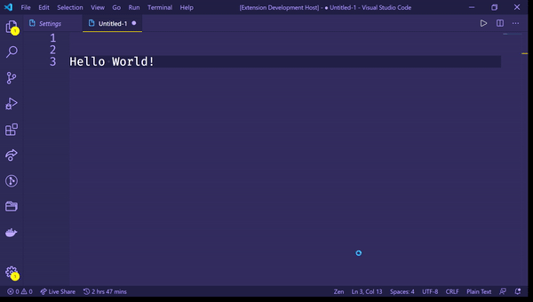

# Translate in VS Code
## Usage
It's too easy;
* Just select a text you want
* Open context menu (Right click)
* Press `Translate Select Text`

## Requirements

* Just VS Code

## Extension Settings

You can change language with command.
If you want to source the language to English and target the language  to Turkish just do these:
* Press `CTRL+SHIFT+P`
* Select the `English to Turkish` option

or if you want to source the language to Turkish and target the language  to English just do these:
* Press `CTRL+SHIFT+P`
* Select the `Turkish to English` option

## Release Notes

### 1.0.0

* Translate selected text
* English to Turkish
* Turkish to English

**Enjoy!**
